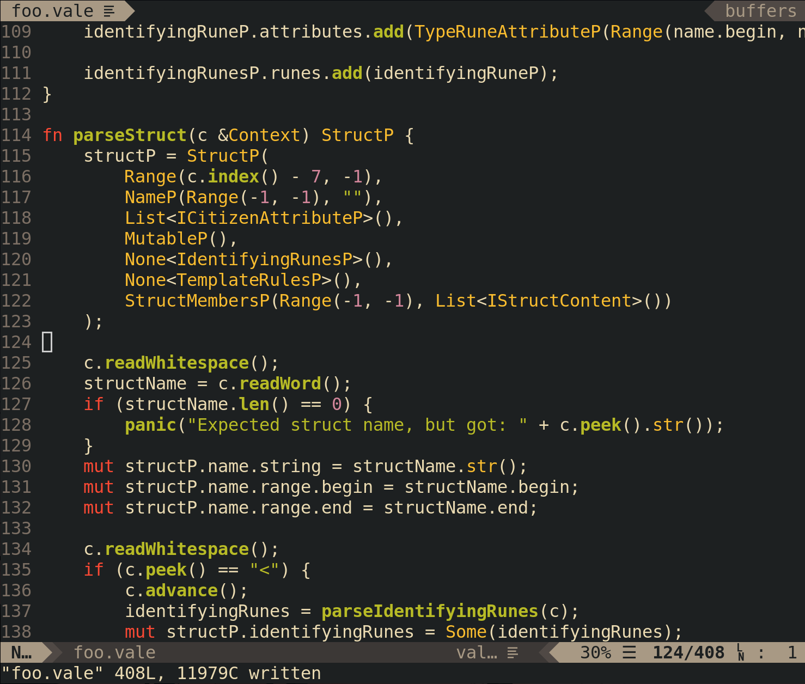

# vale.vim

Vim plugin providing file recognition and syntax highlighting for the Vale programming language.



## Installation

Using [Pathogen](https://github.com/tpope/vim-pathogen):

```
git clone https://github.com/jfecher/vale.vim ~/.vim/bundle/vale.vim
```
